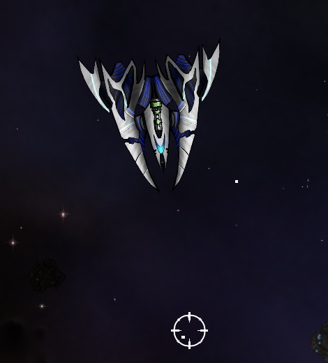

# Hope
My module for the factions task

#### Guns
- Added Mini-Gun
  - Fires at a very high rate
  - High damage
  - Infinite ammunation

#### Projectiles 
- Added enhancedBullet
  - Has much more damage
  - Different color

- Added enchanedMissile
  - Has better aiming
  - Has much more damage
  - Increased speed

# Small Hope

# Medium Hope

# Large Hope

# Capital Hope

# Music
License for music used are:

- Find You - http://www.tannerhelland.com/16/find-you/
- From Here - http://www.tannerhelland.com/18/from-here/
- King of the Desert - http://www.tannerhelland.com/34/king-of-the-desert

# Sprites
Licence for sprites and textures used are:

- Small Hope - http://clipart-library.com/space-ship-image.html
- Medium Hope - https://www.clipartmax.com/middle/m2H7H7G6H7A0b1G6_drawn-spaceship-sprite-top-down-spaceship-png/
- Large Hope - http://millionthvector.blogspot.com/p/free-sprites_12.html
- Capital Hope - https://www.kisspng.com/png-sprite-spacecraft-low-poly-2d-computer-graphics-sp-991894/
- Station - https://www.clipartmax.com/middle/m2i8K9i8b1m2G6i8_space-station-space-station-sprite/
